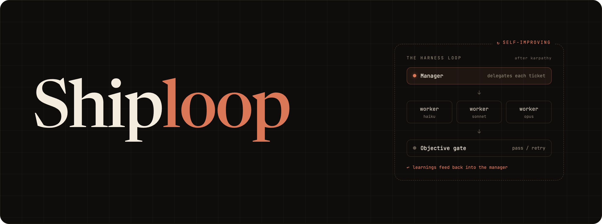
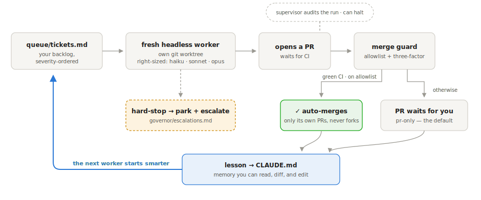

# shiploop

<p align="center">
  
</p>

<p align="center">
  <a href="https://github.com/anshss/shiploop/actions/workflows/ci.yml"></a>
  <a href="LICENSE"></a>
</p>

A self-improving multi-agent harness for Interactive Coding Agents. It works across every repo in your product - a fresh, right-sized headless agent per ticket, guarded auto-merge and after every resolved ticket it writes the durable lesson.

## Install

```bash
# In Claude Code:
/plugin marketplace add anshss/shiploop
/plugin install shiploop@shiploop
```

This installs the plugin once, globally — commands appear as `/shiploop:setup`, `/shiploop:govern`, `/shiploop:flows`, etc. in every session. Each project you want shiploop on then gets its own one-time setup (next section). Prefer a clone? `git clone https://github.com/anshss/shiploop.git ~/.claude/skills/shiploop && bash ~/.claude/skills/shiploop/install.sh` — same commands, same layout.

## Quickstart

### 1. Set it up on your project — one command, one round of questions

Open Claude Code in the project you want shiploop to work on, and run setup:

```bash
cd ~/code/your-project && claude
```
```
/shiploop:setup
```

Setup detects what the folder is and adapts:

- **An existing repo → wrap-in-place.** Your repo moves into a subfolder and the workspace scaffolds around it. The path you `cd` into stays the same, full history travels as one unit verified byte-identical, and a generated `.wrap-undo.sh` reverses everything until it all verifies.
- **A folder of repos (or an empty one) → fresh scaffold.** Each subfolder with its own `.git` becomes a sub-repo. One repo is a fine workspace — add more later.
- **An existing workspace → upgrade**, component by component, without touching your config.

It detects everything first (sub-repos, ports, dev commands, package manager), asks its questions in **one batched round**, then runs to completion. You end up with a workspace around your code:

```
your-project/
  <your-repo>/              # your code, untouched, still its own git repo
  queue/tickets.md          # the backlog the governor grinds
  governor/                 # doctrine, escalations, improvements
  scripts/                  # status / dev / doctor / worktrees / govern
  scripts/lib/workspace.sh  # the ONE config file — every knob lives here
  CLAUDE.md                 # git-tracked memory; every resolved ticket adds a lesson
```

### 2. See your product's risk map — 10 minutes, nothing deploys

```
/shiploop:flows extract   # inventory every user-facing path that might break
/shiploop:flows list      # your risk map: proven / untested / stale / failed
```

Extract fans out one agent per surface, and the inventory is staged for your approval — it opens no PRs, merges nothing, rents no compute. On a fresh extract everything is UNTESTED: that list is exactly the map of what you don't yet know works. Proving a path (`/shiploop:flows file <id>`) *can* deploy, so it's dry by default: nothing files until `--yes`, `--max-deploys N` caps a batch, and `--all-stale`/`--all-untested` refuse unless the orphan-sweep (`GOVERN_DEPLOY_SWEEP_CMD`) is wired.

### 3. File one ticket, watch it ship

From the workspace root:

```bash
scripts/govern/file-ticket.sh "Fix empty-state copy on /settings"   # into queue/tickets.md
bash scripts/govern/config-check.sh   # free smoke test — no tokens, no Claude auth
```
```
/shiploop:govern                      # fresh worker → edits → PR → waits for CI
```

New workspaces start on the **pr-only** rung: workers open PRs, the governor never merges — you click merge. When you've read enough of a repo's PRs to trust the pattern, add it to `GOVERN_MERGE_REPOS` and its green-CI PRs auto-merge, guarded ([Trust](#trust)).

## How it works

The governor is a **pure-bash driver** (`scripts/govern/run-loop.sh`): it owns state and control flow deterministically and spends near-zero Claude context. Model tokens burn only inside the fresh headless workers it spawns.

<p align="center">
  <picture>
    <source media="(prefers-color-scheme: dark)" srcset="assets/how-it-works-dark.svg">
    
  </picture>
</p>

- **One ticket = one fresh headless session** in its own git worktree. Context stays flat, workers ship in parallel without collisions, no run inherits the last one's bad state.
- **Right-sized models.** The interactive "brain" stamps each ticket with the cheapest capable tier (`haiku` mechanical / `sonnet` standard / `opus` judgment-heavy); retries escalate to `GOVERN_WORKER_MODEL` unconditionally.
- **A periodic supervisor** (another cheap fresh session) audits the run and can halt it. Hard-stops land in `governor/escalations.md` for you.
- **It gets better over time.** `/shiploop:resolve` promotes each ticket's durable lesson into the right `CLAUDE.md` before deleting the ticket — memory you can read, diff, and edit. Harness improvements accrete in `governor/improvements.md` (observe → propose → triage; never auto-applied to safety rails), and the hub channel (`/shiploop:update` / `/shiploop:push`) moves mechanism fixes between your workspace and the template repo — always via human-reviewed PR.

## Trust

Autonomy is a ladder, not a switch — one knob, `GOVERN_AUTONOMY` in `scripts/lib/workspace.sh`:

| Rung | Behavior |
|---|---|
| `observe` | Workers do real work but every PR opens as a **draft**; nothing merges |
| `pr-only` | *(default on new scaffolds)* Normal PRs; a human clicks merge |
| `auto` | Auto-merge on green-or-no-checks CI — but only for repos on `GOVERN_MERGE_REPOS` (empty by default) |

What makes the top rung safe to reach for:

- **Three-factor merge guard** — a PR auto-merges only if its author is the governor's own worker identity, its branch matches the governor's naming, and its head is not from a fork. Any factor missing → stays open for a human.
- **Hard-stops** — destructive git, prod data, destructive schema, secrets: the doctrine in `governor/preferences.md` makes a worker park + escalate instead of acting.
- **Bounded blast radius** — workers run `claude -p --permission-mode bypassPermissions` by design, scoped to a throwaway worktree plus the branch it pushes; `.githooks/pre-push` rejects any harness-repo push except a sanctioned governor run.
- **Fail-closed evidence gates** on the self-improvement and sync ports: `bash -n`, a forbidden-identity-strings gate, and a scaffold-test baseline diff. Any failure escalates instead of merging.

Cost, observed: **$3.03 median / $4.49 mean per resolved ticket** ($1.34–$12.00 range, N=32 tracked tickets), from Claude Code's own reported cost, not an estimate — see **[PROOF.md](PROOF.md#4-cost-per-resolved-ticket)** for the full distribution and methodology. That sample skews `opus`-heavy on self-referential harness tickets; right-sizing (haiku/sonnet on tickets that don't need opus) pushes it down. `config-check.sh` is the only truly free smoke ($0, no auth); `/shiploop:govern --dry-run` runs a real worker in plan mode — zero side effects, but it costs tokens. For your first run: keep the allowlist empty, watch one ticket end-to-end, and set a spend cap in your Anthropic dashboard.

## Commands

| Command | What it does |
|---|---|
| `/shiploop:setup` | Scaffold or upgrade a workspace — wrap-in-place inside an existing repo, or from a parent folder of repos |
| `/shiploop:govern` | Ship your backlog — the bash-driven ticket loop, end to end |
| `/shiploop:flows` | Inventory (`extract`), inspect (`list`), and validate (`file`) your product's user-facing paths |
| `/shiploop:investigate` | Triage a bug: seed notes, pull logs, form a hypothesis, propose a fix |
| `/shiploop:resolve` | Close a ticket: confirm the PR, promote the lesson to `CLAUDE.md`, delete the entry, sweep for new tickets |
| `/shiploop:update` | Pull the latest hub templates into this workspace (`workspace.sh` is never overwritten) |
| `/shiploop:push` | Port local mechanism improvements back to the hub as a human-reviewed PR (never auto-merges) |

`bash scripts/doctor.sh` warns when your workspace lags the hub by N releases.

## Configuration

Everything lives in one file — `scripts/lib/workspace.sh`. Advanced lanes ship **off** so a fresh install is inert until you opt in:

| Knob | Default | Turns on |
|---|---|---|
| `GOVERN_AUTONOMY` | `pr-only` | Trust-ladder rung (`observe` / `pr-only` / `auto`); absent = `auto` for pre-knob installs |
| `GOVERN_MERGE_REPOS` | empty | Per-repo auto-merge allowlist (requires `auto`) |
| `GOVERN_WORKER_MODEL` | `opus` | Fleet-wide worker default; per-ticket `Model:` line overrides first attempts |
| `WSP_LINT_FIX_CMD` | empty | Pre-commit lint/format fix across sub-repos |
| `GOVERN_LOCAL_FIRST_REPOS` | empty | Repos with no prod DB — additive migrations merge instead of parking |
| `GOVERN_PUBLIC_REPOS` | auto-detect | Public repos get neutral `sl-<hex>` branches, no ticket ids on PRs |
| `GOVERN_EXTERNALIZE_REPO` / `_SUBREPO` | empty | Stage low-severity OSS tickets as public "good first issue"s — filed only on your approval |
| `GOVERN_UPSTREAM_HARNESS_REPO` / `_DIR` | empty | The `/shiploop:push` sync channel to your hub fork |
| `WSP_PR_FOOTER` | on | "shipped by shiploop" attribution line on worker PRs (`off` to suppress) |

## Requirements

- **Claude Code CLI** — Act 1 (setup + extract) needs only this, git, and `jq`
- **`jq`** — hard-required; the scaffolder and governor fail closed without it
- **`gh` CLI**, authenticated — for the governor (opens PRs, reads CI); not needed for the risk map
- **git ≥ 2.20**, **bash ≥ 4** (macOS's 3.2 also works — templates are guarded for both)

## How it compares

Devin, Cursor, Copilot, and Claude Code all do one task you hand them well. shiploop is the layer above: it runs a **backlog** across a **fleet** — a manager, not another IC. If your bottleneck is one hard task, use those. If it's a growing queue of small-to-medium changes across N repos, and you'd rather do the spec work than the shipping, use this.

## Proof

281 tickets auto-found and resolved on the maintainer's production multi-repo product, of 290 governor-authored PRs merged — 0 confirmed reverts. The harness audits, fixes, and releases *itself* through the same loop — every governor edge case found in the field ports back into these templates with a regression test, and the hermetic suite goes RED in CI before a breaking change can merge. See **[PROOF.md](PROOF.md)** for the full sanitized evidence artifact: auto-merge/human-merge split, revert rate, cost-per-ticket distribution, and the exact re-runnable queries behind every number.

## Contributing

See [CONTRIBUTING.md](CONTRIBUTING.md). Everything the scaffolder installs lives under `templates/`; the seven slash commands under `commands/`; hermetic governor tests under `templates/govern/test/`.

## License

MIT.
