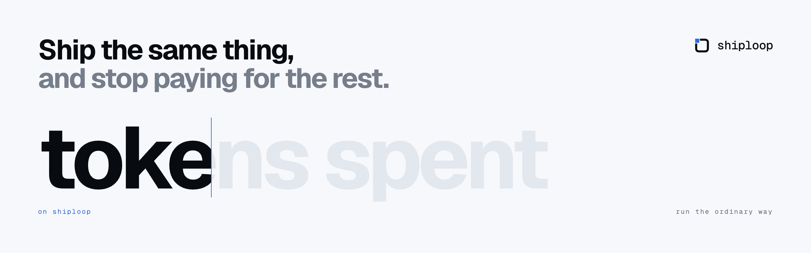

<p align="center">
  
</p>

<p align="center">
Shiploop is a harness for Claude Code. Most token tools compress what Claude reads.  <br> 
Shiploop changes how each session runs: which model handles the work, what context it gets, and how much runs in parallel,
so the same work ships on fewer tokens.
</p>

## Get Started

Install the plugin globally once. `/shiploop:setup` and the rest then appear in every session:

```
/plugin marketplace add anshss/shiploop
/plugin install shiploop@shiploop
```
or 
```
git clone https://github.com/anshss/shiploop.git ~/.claude/skills/shiploop &&
bash ~/.claude/skills/shiploop/install.sh
```

Then set it up on a project, once per project:

```bash
cd ~/code/your-project && claude   # then run: /shiploop:setup
```

Setup adapts to the folder. A single existing repo is wrapped in place: moved into a subfolder while remaining a separate Git repo, with history verified byte-for-byte and your cd path unchanged. A folder of repos or an empty folder gets a new scaffold; existing workspaces are upgraded component by component without changing your config.

Add every repo related to your project to the folder. Shiploop detects sub-repos, ports, dev commands, and your package manager, asks all setup questions in one batch, then finishes setup. It never overwrites README.md, CLAUDE.md, config, or governor files without --yes, and creates .wrap-undo.sh before wrapping.

## How Shiploop works

You launch regular Claude Code sessions to build your project. What comes out of those conversations gets broken into short items called **tickets**, kept in one file, the **queue**. You choose which tickets run and in what order: dispatch is a call you make by naming tickets, not an automatic sweep through the whole queue.

How a named ticket actually ships, in one pass:

1. Each ticket gets a fresh **worker**: a trim, single-ticket session in its own Git worktree, so parallel tickets can never collide or inherit each other's state. It reads only what that ticket needs, makes the change, opens a pull request, and writes a short report.
2. Advisor-worker orchestration. Intractive claude session becomes a advisor and spawns subagent in right-sized cheap-tier models. A classified judgment failure of subagent raises reasoning effort and files a re-specification request for the advisor.
3. When a ticket resolves, it leaves a short lesson in CLAUDE.md, which every later session reads, so the next worker starts a little smarter.


### Why this uses fewer tokens

The goal is simple: spend the fewest tokens per shipped ticket. Here is what actually does that:

- **Every worker shares a scripted codebase map.** A worker is a single-ticket session that reads the code and does the job. Pre-dispatch scripts index files, symbols, and structure, so workers do not repeatedly rediscover the repository. Retries inherit prior findings, and manual audits read only what changed.

- **Workers share one cached prompt prefix.** Claude Code puts per-session details like the working directory, git-status snapshot, and memory paths near the top of each worker’s system prompt. That means workers on different jobs diverge within the first few hundred bytes, eliminating the cacheable prefix. Every worker then pays the full cache-write cost for the prompt and tool schemas on turn one. With dozens of workers, retries, and escalations, that cost compounds on every spawn instead of being amortized across a long-lived session. Shiploop keeps the shared system prompt byte-identical, moves worker-specific context into the first user message, and keeps trims static. Later workers can then reuse the expensive cached prefix instead of rewriting it.

- **Workers run lean.** Each Shiploop worker gets only the tools it needs: no MCP servers or unused definitions. Trimming the tool list alone cuts tool bytes by 66.7%.

- **Model orchestration.** The costly mistake is asking low-cost workers to rediscover a solution at the wrong tier. A high-tier session must turn the change into a proposed solution before dispatch; the lower-cost worker implements it in an isolated worktree and stops at a PR. Dispatches without a proposal are refused, steering is capped, and failures first raise reasoning effort rather than model tier.

- **Routine changes skip the model.** Shiploop detects mechanical work during its survey, applies it deterministically, and verifies it. Ambiguous, unsafe, or unverified work goes to a normal worker.

- **Successful output stays out of the transcript.** Green test output adds little value, so it is omitted; failures are trimmed to the useful excerpt. CI logs work the same way. The interactive driver exposes this through `npm run vf -- <cmd>` and can delegate lookup or multi-file diagnosis to lookup and investigator agents.

- **A watchdog stops runaway sessions.** It enforces a time limit, while the stall, identical-command-loop, and tool-error-rate checks measure whether the child is making progress—not how much it read. The worktree is kept so work can resume rather than restart. Both controls are independently configurable.

- **Related work can share exploration.** A worker can handle tickets whose scout-measured file paths overlap, exploring an area once instead of once per ticket. A five-ticket batch is therefore far cheaper than five separate workers.

- **Retries resume instead of restart.** Failed workers keep their worktree and findings, avoiding another clone and repeated exploration.

- **Memory improves within a fixed budget.** Resolved tickets add lessons to CLAUDE.md, which is re-sent on every turn. Entries are capped, the file has a budget, and overflow moves to an appendix.

- **Blocked work is caught early.** Shiploop checks dependencies, repository health, capacity, setup, and duplicate upstream fixes before dispatching a worker. Work that cannot succeed never consumes one.

Tokens are the currency. Shiploop breaks work into tickets; you choose the priorities, and each dispatched ticket is completed with the least token spend. The coordination layer uses no model tokens. The zero-model lane is off by default. Parallelism improves throughput, not per-ticket efficiency.

## The dispatch flow

You name the tickets, and the coordination around them is pure Bash using near-zero Claude context: `scripts/govern/pre-dispatch-check.sh <N>` returns one verdict line before anything spawns, and `scripts/govern/resolve-ticket.sh <N>` awaits CI, merges and lands the resolution after. Model tokens are spent only by the worker in between. Every dispatch runs every gate: claim lock, `Depends on:`, staleness, base CI, upstream drift, and failure streak.

<p align="center">
  <picture>
    <source media="(prefers-color-scheme: dark)" srcset="assets/how-it-works-dark.svg">
    
  </picture>
</p>

- **Inside the worktree.** Branches are ticket-named in every in-scope sub-repo; out-of-scope sub-repos stay detached and read-only. A worker's prompt is built from a fixed skeleton, `governor/preferences.md`, the ticket text, and, on a retry, the prior attempt's handoff. It can act without asking permission at each step, but only inside that worktree, on the branch it pushes.
  
- **Manual audit on demand** `npm run govern:audit` starts another cheap, fresh session to review a run and can return halt. Hard stops go to `governor/escalations.md`. It spends no model tokens unless you invoke it.

- **Harness improvement follows discipline.** Fixes to the mechanism itself go to `governor/improvements.md` through observe, propose, triage, and never auto-apply to safety rails. `/shiploop:update` and `/shiploop:push` move those fixes between the workspace and template repo, always through a human-reviewed PR.

## Glossary

One noun, one meaning. Every page pairs a term with its definition on its first prose use, because none of these
words is exclusively ours: Factory's docs, for one, call their in-session delegated children "worker
agents". In shiploop they mean exactly this:

| Term | Definition |
|---|---|
| **governor** | The deterministic script layer under `scripts/govern/`: `pre-dispatch-check.sh` gates a ticket, `resolve-ticket.sh` awaits CI, merges, and lands the resolution. It owns state and control flow deterministically and never calls a model itself; deciding *when* to run it is the driver's job. |
| **driver** | The orchestrating session: your interactive Claude Code session. A driver dispatches and relays verdicts; it does not bulk-read product source. |
| **worker** | The trim, single-ticket session: an `Agent(subagent_type: "worker")` subagent in your own session, running at a fixed model floor in its own worktree, ending at a PR plus a structured report. Never used for any other kind of child. |
| **scout** | The cheap pre-dispatch survey pass (haiku). It only surveys: verified file paths, whether tests cover the area, whether history holds a precedent commit. Cached per run, so a retry never re-scouts. |
| **supervisor** | The review pass over a run's state (`npm run govern:audit`, `GOVERN_SUPERVISOR_MODEL`). It can return a `halt` verdict; it never edits code. |
| **subagent** | The platform's own term for an Agent-tool child that is **not** `subagent_type: "worker"` (the shipped `lookup` and `investigator` agent types, or a stock `Agent` call). Sized per the delegation table for investigation, sweeps, and diagnosis. A subagent is never called a worker, and ticket-shaped work never goes to one. |

## Commands

| Command | What it does |
|---|---|
| `/shiploop:setup` | Scaffold or upgrade a workspace: wrap-in-place inside an existing repo, or from a parent folder of repos |
| *(say "work on \<tickets\>")* | Ship the tickets you name: natural language onto the session lane (`pre-dispatch-check.sh` → a worker → `resolve-ticket.sh`), end to end, one ticket at a time |
| `/shiploop:flows` | Inventory (`extract`), inspect (`list`), and validate (`file`) your product's user-facing paths |
| `/shiploop:compress` | Compress this workspace's `CLAUDE.md` by moving mechanically-triggered rules into just-in-time rule packs, deleting none of them (operator-triggered, never automatic) |
| `/shiploop:update` | Pull the latest hub templates into this workspace (`workspace.sh` is never overwritten) |
| `/shiploop:push` | Port local mechanism improvements back to the hub as a human-reviewed PR (never auto-merges) |
| `npm run govern:audit` | Manual audit: review a run's state on demand, zero model spend unless invoked |
| `npm run govern:context-budgets` | Report context budgets (lesson-cap and total-budget overage, learnings TTL archiving) outside a dispatch; never edits `CLAUDE.md` (`--dry` to preview) |
| `npm run govern:trim` | Evidence-based CLAUDE.md compression detector on its own: classifies every over-budget block and writes ranked candidates, never edits the file (`--apply <hash>`, `--still-true <hash>`, `--dry-run`) |
| `npm run govern:externalize` | File open low-severity tickets as public good-first-issues and drop them from the queue (opt-in, off until `GOVERN_EXTERNALIZE_REPO` is set) |

`bash scripts/doctor.sh` warns when your workspace lags the hub by N releases, and **fails** when root `CLAUDE.md` exceeds its context budget (`SHIPLOOP_CLAUDEMD_MAX_CHARS`, default 14000), since an over-budget file is a tax on every turn of every session. Nothing automatic ever edits that file. Every governor run-end classifies it on evidence, never on size (`dead-citation`, `duplicate`, `jit-candidate`, and `judgment` blocks, which are never proposed at all) and writes ranked candidates to `governor/claudemd-trim-proposals.md`; rules under an anti-pattern / load-bearing / hard-rule heading are protected outright. `/shiploop:compress` is the operator path through them, or `claudemd-trim.sh --apply <hash>` / `--still-true <hash>` one at a time. Doctor reports the size and how many candidates are pending.

### Fleet visibility

A worker is a subagent the session runs to completion, and structured state is written only when
it finishes, so while one or more are in flight at once *nothing on disk says "running"* on its
own, which is why no surface could ever show them without instrumentation.

`GOVERN_EVENTS=1` fixes that with one append-only log, `governor/events.jsonl`, and three readers
fold it. The emitter can never abort a dispatch: a failed append is swallowed silently, by construction.

```
$ npm run govern:status
fleet: 2 active · 3 resolved · 1 parked · 0 failed · 1 escalated
run:   gov-20260901T101500Z-4242 (running, mode=live, up 41m)
  #94    opus     22m    pid 44112  effort=high
  #97    sonnet   4m     pid 44530  effort=medium
```

## Configuration

Every knob lives in one file, `scripts/lib/workspace.sh`, and ships with sane defaults so a fresh
install is inert until you opt in. Full table and behaviour: [CONFIGURATION.md](CONFIGURATION.md).

## Contributing

See [CONTRIBUTING.md](CONTRIBUTING.md). Everything the scaffolder installs lives under `templates/`; the slash commands under `commands/`; hermetic governor tests under `templates/govern/test/` (hub-only; the suite is not installed into a workspace).

## License

[Apache License 2.0](LICENSE). Includes an express patent grant and a
trademark reservation; redistributions must carry the [NOTICE](NOTICE) file
and state any changes made. Releases up to and including v1.15.1 were
published under the MIT license and remain available under those terms.
