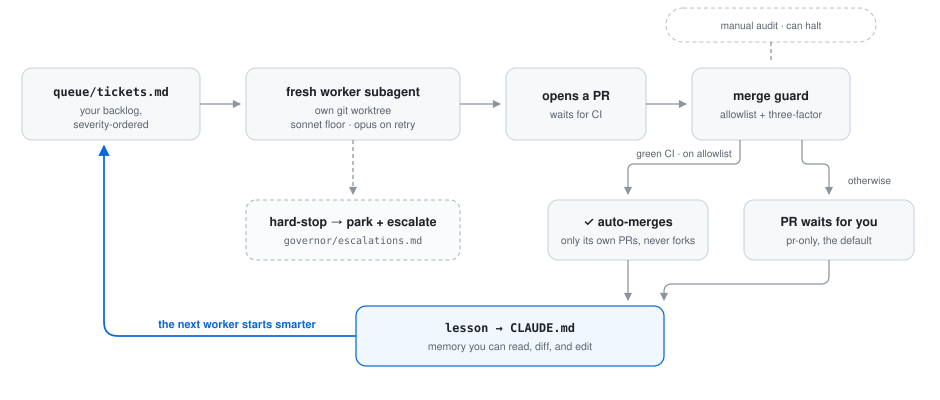

# shiploop

<p align="center">
  
</p>

<p align="center">
  <a href="https://github.com/anshss/shiploop/actions/workflows/ci.yml"></a>
  <a href="LICENSE"></a>
</p>

A self-improving multi-agent harness for Interactive Coding Agents. It grinds a ticket backlog across every repo in your product: a fresh headless agent per ticket, guarded auto-merge on green CI, and a durable lesson written into your tracked `CLAUDE.md` after every resolved ticket.

### Built to spend fewer tokens

One goal: the fewest tokens per shipped ticket. Roughly in order of how much each one saves.

- **Every ticket is sized before it runs.** The Claude session that files a ticket stamps it with `Model:` and `Effort:`, and the governor honors that for the first attempt: haiku for mechanical single-file work, sonnet for standard search and edit, opus only for the judgment-heavy ones. You don't set these by hand. This is the biggest lever by a wide margin, because it's the difference between running everything on opus and running most things on haiku. And when a ticket arrives with neither field, it no longer falls through to opus: a scout pass runs first, at the haiku tier, and greps the real code to measure how many files and repos the fix plausibly touches, whether tests already cover the area, and whether git history holds a precedent commit. A deterministic scoring table — not a second model call — turns that measurement into a tier. Reconnaissance costs about a thousandth of the work, so spending a fraction of a cent to decide whether to spend three dollars or thirty is the best trade in the harness. An explicit `Model:` or `Effort:` always outranks the scout; it replaces the blanket default, never the operator.

- **It won't start work that can't succeed.** Before spawning anything it checks a few things. Is this repo's CI already red? Is this ticket waiting on another that isn't done? Does it touch a file already being changed upstream? Is this a check whose setup isn't wired yet? Is the disk nearly full? Any yes and it skips. No agent, no tokens. A session you never start is the cheapest one there is.

- **It won't pay to rediscover a fix that already exists.** If your workspace runs the harness on itself, a mechanism script in your `scripts/` has a counterpart in the hub — and another fleet may have already pushed the identical fix up. Before dispatching, the gate reads the ticket's `Where:` line and asks, for each file it names, whether the hub is ahead of you on that file. If it is, you get told to pull the fix down instead of a worker spending a full session re-deriving it. The direction test is the whole trick: two files differing tells you nothing about who moved, so it reuses the sync marker to tell *your* unported work apart from someone else's. Entirely file and git reads — no model call, no network. And it can never close a ticket on its own; the most it does is park one and ask you. Worth knowing this only fires on tickets pointing at harness mechanism files, so on an ordinary product backlog it will rarely trigger.

- **Running the loop costs nothing.** The part that picks tickets, tracks state and merges PRs is plain bash. It never calls a model. Tokens get spent inside the agents it starts, nowhere else.

- **Each agent starts with a small context.** No MCP servers, no slash commands or skill descriptions, no project hooks. That's about 2,600 tokens saved on every single turn, and the starting context is roughly a quarter of everything a session spends.

- **The prompt is built to be cached.** The unchanging parts come first and your ticket text goes last, so every agent reuses one cached prefix instead of paying to build its own.

- **Agents are told to stay small.** Hand heavy reading to cheap sub-agents. Keep build output in a file instead of pasting it into the conversation. Keep replies short. And don't spin up a sub-agent for something you could finish in two commands.

- **Batching is the big one you have to switch on.** `GOVERN_BATCH_MAX` lets one agent take several tickets from the same area so it explores once instead of once each. Exploration is most of what a ticket costs, so this can save more than anything else here. Off by default, because the grouping heuristic hasn't been proven on a real backlog yet.

- **Settled work never gets done again.** Agents share a list of what's already been attempted, re-check against the remote before starting in case a sibling just finished the same ticket, remember across runs that a ticket is waiting on a PR to merge, and skip anything already handed to outside contributors. A second `govern` run won't even start while one is still going.

- **It only starts as many agents as there is work for.** A one ticket backlog spawns one agent, not four idle ones.

- **A retry picks up where it left off.** The old worktree is kept, so attempt two doesn't re-clone and re-explore — and now it inherits the first attempt's notes too. A worker keeps a scratchpad as it works: which files turned out to matter, what the root cause was, what it tried, what failed and why. On a retry that file is pasted into the new agent's prompt, so it starts from what the last one learned instead of paying for the same exploration twice. Exploration is most of what a ticket costs, and before this a failed attempt bought you nothing at all. The notes are handed over as evidence to weigh, not as fact — a wrong conclusion from attempt one shouldn't become gospel for attempt two — and they stay in the worktree, git-ignored, so they never reach a PR. And the failure itself gets read first: an infrastructure or CI failure retries at the same tier with the log attached, running out of budget raises the tier, and only a genuine judgment failure buys both a bigger model and more thinking. It never just reflexively re-bets on the most expensive model.

- **It stops things that run away.** A couple of failed attempts on a ticket and it escalates to you instead of retrying forever. A run that keeps failing halts itself. And `GOVERN_WORKER_MAX_TOKENS` hard-stops a single agent that wanders past a token ceiling, though that one is off by default.

- **What it learns, it keeps.** Every finished ticket writes a lesson into your `CLAUDE.md`, so the next agent doesn't rediscover it. Plain text you can read, edit and delete.

- **Agents are told to size the check to the change.** A docs-only edit gets a lint or a parse check instead of a full test suite, since a suite run is the single biggest context flood in a session. Anything touching executable code still runs the full suite, and when in doubt it runs the full suite anyway.

- **The reviewer is cheap, and only shows up when needed.** The supervisor auditing a run is a sonnet session in read-only mode that reads only what changed since it last looked. The deeper self-improvement pass runs only after a run that actually hit friction, so a clean run pays for no review at all.

- **Validations don't get paid for twice.** A flow nobody uses gets retired instead of re-tested forever. A long cloud validation can refuse to start before it provisions anything. Once running, it survives past the usual task timeout instead of being killed and re-run from scratch, and its result is captured even if nothing was watching when it finished.

- **Branches start from current code.** New worktrees are cut from a freshly fetched `origin/main`, not a stale local copy, so a PR isn't born already conflicted and needing a second attempt.

- **It cleans up after itself.** A worker stopped mid-flight has its preview deploys and other billable resources torn down rather than left running, and ending a session kills stray dev processes before they hold ports hostage. It also refuses to delete a worktree holding commits you never pushed.

- **Some work doesn't have to be yours.** On a public repo, low-severity tickets can go out as GitHub issues for outside contributors instead of spending one of your agents. Off by default, and nothing gets published without your say-so.

- **Repeated lookups happen once.** Your GitHub identity, each repo's visibility, what your CLI supports. All resolved a single time per run, not once per PR. Start-of-run housekeeping runs once for the whole run too, not once per agent.

- **You can see where the tokens went.** Every attempt records its model, effort, tokens and cost, and a run ends by separating what you spent on your product from what you spent maintaining the harness itself.

- **Checking your setup is free.** `config-check.sh` validates your whole config without calling Claude at all. Worth knowing that `--dry-run` is not free. The merge and bookkeeping steps are only simulated, but it does run a real agent in plan mode.

Two things worth knowing up front. Running four agents at once is the default (`GOVERN_PARALLEL_DEFAULT`), which gets more done per hour but costs four times as much at once, and it doesn't make any single ticket cheaper. And several of the protections above only apply when the governor pulls from your backlog itself: if you name specific ticket numbers, you get neither batching nor the give-up-after-repeated-failures brake.

## Install

```bash
# In Claude Code:
/plugin marketplace add anshss/shiploop
/plugin install shiploop@shiploop
```

This installs the plugin once, globally: commands appear as `/shiploop:setup`, `/shiploop:govern`, `/shiploop:flows`, etc. in every session. Each project you want shiploop on then gets its own one-time setup (next section). Prefer a clone? `git clone https://github.com/anshss/shiploop.git ~/.claude/skills/shiploop && bash ~/.claude/skills/shiploop/install.sh`. Same commands, same layout.

## Quickstart

### 1. Set it up on your project: one command, one round of questions

Open Claude Code in the project you want shiploop to work on, and run setup:

```bash
cd ~/code/your-project && claude
```
```
/shiploop:setup
```

Setup detects what the folder is and adapts:

- **An existing repo → wrap-in-place.** Your repo moves into a subfolder and the workspace scaffolds around it. The path you `cd` into stays the same, full history travels as one unit verified byte-identical, and a generated `.wrap-undo.sh` reverses everything until it all verifies.
- **A folder of repos (or an empty one) → fresh scaffold.** Each subfolder with its own `.git` becomes a sub-repo. One repo is a fine workspace. Add more later.
- **An existing workspace → upgrade**, component by component, without touching your config.

It detects everything first (sub-repos, ports, dev commands, package manager), asks its questions in **one batched round**, then runs to completion. You end up with a workspace around your code:

```
your-project/
  <your-repo>/              # your code, untouched, still its own git repo
  queue/tickets.md          # the backlog the governor grinds
  governor/                 # doctrine, escalations, improvements
  scripts/                  # status / dev / doctor / worktrees / govern
  scripts/lib/workspace.sh  # the ONE config file; every knob lives here
  CLAUDE.md                 # git-tracked memory; every resolved ticket adds a lesson
```

### 2. See your product's risk map: 10 minutes, nothing deploys

```
/shiploop:flows extract   # inventory every user-facing path that might break
/shiploop:flows list      # your risk map: proven / untested / stale / failed
```

Extract fans out one agent per surface, and the inventory is staged for your approval: it opens no PRs, merges nothing, rents no compute. On a fresh extract everything is UNTESTED: that list is exactly the map of what you don't yet know works. Proving a path (`/shiploop:flows file <id>`) *can* deploy, so it's dry by default: nothing files until `--yes`, `--max-deploys N` caps a batch, and `--all-stale`/`--all-untested` refuse unless the orphan-sweep (`GOVERN_DEPLOY_SWEEP_CMD`) is wired.

### 3. File one ticket, watch it ship

From the workspace root:

```bash
scripts/govern/file-ticket.sh "Fix empty-state copy on /settings"   # into queue/tickets.md
bash scripts/govern/config-check.sh   # free smoke test, no tokens, no Claude auth
```
```
/shiploop:govern                      # fresh worker → edits → PR → waits for CI
```

New workspaces start on the **pr-only** rung: workers open PRs, the governor never merges. You click merge. When you've read enough of a repo's PRs to trust the pattern, add it to `GOVERN_MERGE_REPOS` and its green-CI PRs auto-merge, guarded ([Trust](#trust)).

## How it works

The governor is a **pure-bash driver** (`scripts/govern/run-loop.sh`): it owns state and control flow deterministically and spends near-zero Claude context. Model tokens burn only inside the fresh headless workers it spawns.

<p align="center">
  <picture>
    <source media="(prefers-color-scheme: dark)" srcset="assets/how-it-works-dark.svg">
    
  </picture>
</p>

- **One ticket = one fresh headless session** in its own git worktree. Context stays flat, workers ship in parallel without collisions, no run inherits the last one's bad state.
- **Right-sized models.** The interactive "brain" filing a ticket stamps it with a `Model:` field (`haiku` mechanical / `sonnet` standard / `opus` judgment-heavy) and an `Effort:`, and the spawn honors both on the first attempt. A ticket that names neither is sized by a **scout pass** instead of defaulting to opus: a cheap haiku recon run measures the real scope (files touched, repos involved, existing test coverage, a precedent commit in history, local edit vs contract change, concrete vs vague fix direction) and a deterministic bash scoring table maps that to `haiku`/`low`, `sonnet`/`medium`, or `opus`/`high`. The verdict is cached per run so a retry never re-scouts, and it is validated and clamped before use — a malformed scout falls back to `GOVERN_WORKER_MODEL` loudly, and clamping only ever pushes a ticket up the ladder, never down. Retries are classified rather than blindly escalated: an infra or CI failure retries at the same tier, running out of budget raises the tier, and a judgment failure raises both tier and effort.
- **A periodic supervisor** (another cheap fresh session) audits the run and can halt it. Hard-stops land in `governor/escalations.md` for you.
- **It gets better over time.** Every resolved ticket promotes its durable lesson into the right `CLAUDE.md` before the entry is deleted: memory you can read, diff, and edit. Harness improvements accrete in `governor/improvements.md` (observe → propose → triage; never auto-applied to safety rails), and the hub channel (`/shiploop:update` / `/shiploop:push`) moves mechanism fixes between your workspace and the template repo. Always via human-reviewed PR.

## Trust

Autonomy is a ladder, not a switch. One knob, `GOVERN_AUTONOMY` in `scripts/lib/workspace.sh`, controls it:

| Rung | Behavior |
|---|---|
| `observe` | Workers do real work but every PR opens as a **draft**; nothing merges |
| `pr-only` | *(default on new scaffolds)* Normal PRs; a human clicks merge |
| `auto` | Auto-merge on green-or-no-checks CI, but only for repos on `GOVERN_MERGE_REPOS` (empty by default) |

What makes the top rung safe to reach for:

- **Three-factor merge guard.** A PR auto-merges only if its author is the governor's own worker identity, its branch matches the governor's naming, and its head is not from a fork. Any factor missing → stays open for a human.
- **Hard-stops.** Destructive git, prod data, destructive schema, secrets: the doctrine in `governor/preferences.md` makes a worker park + escalate instead of acting.
- **Bounded blast radius.** Workers run `claude -p --permission-mode bypassPermissions` by design, scoped to a throwaway worktree plus the branch it pushes; `.githooks/pre-push` rejects any harness-repo push except a sanctioned governor run.
- **Fail-closed evidence gates** on the self-improvement and sync ports: `bash -n`, a forbidden-identity-strings gate, and a scaffold-test baseline diff. Any failure escalates instead of merging.

Cost, observed: **$3.03 median / $4.49 mean per resolved ticket** ($1.34-$12.00 range, N=32 tracked tickets), from Claude Code's own reported cost, not an estimate. See **[PROOF.md](PROOF.md#4-cost-per-resolved-ticket)** for the full distribution and methodology. That sample skews `opus`-heavy on self-referential harness tickets; right-sizing (haiku/sonnet on tickets that don't need opus) pushes it down. `config-check.sh` is the only truly free smoke ($0, no auth); `/shiploop:govern --dry-run` runs a real worker in plan mode. Zero side effects, but it costs tokens. For your first run: keep the allowlist empty, watch one ticket end-to-end, and set a spend cap in your Anthropic dashboard.

## Commands

| Command | What it does |
|---|---|
| `/shiploop:setup` | Scaffold or upgrade a workspace: wrap-in-place inside an existing repo, or from a parent folder of repos |
| `/shiploop:govern` | Ship your backlog: the bash-driven ticket loop, end to end |
| `/shiploop:flows` | Inventory (`extract`), inspect (`list`), and validate (`file`) your product's user-facing paths |
| `/shiploop:update` | Pull the latest hub templates into this workspace (`workspace.sh` is never overwritten) |
| `/shiploop:push` | Port local mechanism improvements back to the hub as a human-reviewed PR (never auto-merges) |

`bash scripts/doctor.sh` warns when your workspace lags the hub by N releases.

## Configuration

Everything lives in one file: `scripts/lib/workspace.sh`. Advanced lanes ship **off** so a fresh install is inert until you opt in:

| Knob | Default | Turns on |
|---|---|---|
| `GOVERN_AUTONOMY` | `pr-only` | Trust-ladder rung (`observe` / `pr-only` / `auto`); absent = `auto` for pre-knob installs |
| `GOVERN_MERGE_REPOS` | empty | Per-repo auto-merge allowlist (requires `auto`) |
| `GOVERN_WORKER_MODEL` | `opus` | Fleet-wide fallback tier: used when the ticket names no `Model:` **and** the scout produced no usable verdict |
| `GOVERN_SCOUT` | on | Pre-dispatch scout pass that measures a ticket's scope and picks the tier deterministically; `0` reverts to the blanket `GOVERN_WORKER_MODEL` default |
| `GOVERN_SCOUT_MODEL` | `haiku` | Tier the scout pass itself runs at — recon should cost a rounding error |
| `GOVERN_SCOUT_TIMEOUT` | `180` | Seconds the scout pass may run before it is abandoned and sizing falls back |
| `GOVERN_PARALLEL_DEFAULT` | `4` | Tickets a plain `run-loop.sh` works at once: `N > 1` runs N concurrent backlog drivers (N× the spend); per-run `--parallel[=N]` / `--serial` override it |
| `GOVERN_SUPERVISOR_FLUSH` | on | Out-of-loop supervisor passes so a fan-out keeps the sequential review rhythm: a per-driver run-tail flush plus one whole-run review over the pool (`0` to suppress both) |
| `GOVERN_RETRY_NOTES_MAX_BYTES` | `16000` | Byte cap on the findings scratchpad (`.governor-notes.md`) a retry inherits from the previous attempt; the full file stays on disk in the preserved worktree |
| `GOVERN_WORKER_TOOLS` | empty (off) | Tool-schema trim: `default` passes `--tools <recommended list>` to every worker, cutting the measured 51.7% of the request that tool JSON occupies down to 26.3% (−34.5% request bytes; see `PROOF.md` §5). Or give your own space/comma-separated list. Capability-probed, so an older CLI just skips it |
| `WSP_LINT_FIX_CMD` | empty | Pre-commit lint/format fix across sub-repos |
| `GOVERN_LOCAL_FIRST_REPOS` | empty | Repos with no prod DB: additive migrations merge instead of parking |
| `GOVERN_PUBLIC_REPOS` | auto-detect | Public repos get neutral `sl-<hex>` branches, no ticket ids on PRs |
| `GOVERN_PR_TICKET_REF` | `0` (ids suppressed) | `1` puts the internal ticket id back in PR titles/bodies/commit subjects. By default every worker is told to keep `#N` off the PR and the run-loop scrubs title+body as a backstop; branches stay `ticket-<N>` either way. The opt-out never applies to a **public** repo |
| `GOVERN_EXTERNALIZE_REPO` / `_SUBREPO` | empty | Stage low-severity OSS tickets as public "good first issue"s, filed only on your approval |
| `GOVERN_UPSTREAM_HARNESS_REPO` / `_DIR` | empty | The `/shiploop:push` sync channel to your hub fork |
| `WSP_PR_FOOTER` | on | "shipped by shiploop" attribution line on worker PRs (`off` to suppress) |

### Permissions

| Knob | Default | Turns on |
|---|---|---|
| `GOVERN_PERMISSION_MODE` | `bypassPermissions` | The `--permission-mode` every headless worker runs under. The default lets a worker act without prompting — which is what makes an unattended run possible, and also the single widest grant in the harness. Tighten it if you want workers to stop at the permission boundary; note that a mode which prompts will stall a headless run rather than fail it |
| `GOVERN_WORKER_MCP` | `0` (off) | Give workers the workspace's MCP servers. Off by default: MCP tool schemas are re-sent on every turn, so this is a standing per-turn cost |

### Hard bounds — how a run is guaranteed to end

| Knob | Default | Turns on |
|---|---|---|
| `GOVERN_MAX_TICKETS` | `20` | Tickets one driver will work before stopping. **Per driver** — a parallel backlog run's real ceiling is N × this |
| `GOVERN_MAX_BAD_STREAK` | `4` | Consecutive parked/failed tickets before the run halts itself |
| `GOVERN_MAX_RUNTIME` | `0` (no cap) | Wall-clock seconds. There is **no** time bound unless you set one |
| `GOVERN_WORKER_TIMEOUT` | `3600` (1h) | Seconds one worker may run before it is killed rather than left stalled |
| `GOVERN_WORKER_MAX_TOKENS` | `0` (unlimited) | Token ceiling per worker; crossing it kills the worker with a distinct `budget-exceeded` outcome |
| `GOVERN_MIN_FREE_GB` | `5` | Free-disk floor checked before spawning; below it the run stops rather than filling the volume |

### CI, retries, and cadence

| Knob | Default | Turns on |
|---|---|---|
| `GOVERN_CI_INTERVAL` | `30` | Seconds between CI polls while awaiting checks |
| `GOVERN_CI_MAX_TRIES` | `60` | Polls before CI is treated as never-settling (≈30 min at the default interval) |
| `GOVERN_CI_FIX_TRIES` | `1` | Attempts a worker gets at fixing its own red CI before the ticket parks |
| `GOVERN_CONFLICT_FIX_TRIES` | `1` | Attempts at resolving a merge conflict before parking |
| `GOVERN_INFRA_RETRY` | `1` | Retries for an infrastructure-class failure (API/transport). Retried at the **same** model tier, not escalated |
| `GOVERN_INTERRUPT_RETRY` | `1` | Retries for a worker killed mid-flight |
| `GOVERN_SUPERVISOR_EVERY` | `5` | Tickets between periodic supervisor reviews |
| `GOVERN_SUPERVISOR_MODEL` | `sonnet` | Tier the supervisor pass runs at |
| `GOVERN_BATCH_MAX` | `1` (off) | Same-area tickets one worker may take as a group, exploring once and opening one PR. The largest single cost lever here, off by default because the grouping heuristic is unproven on a real backlog |

### Binaries

| Knob | Default | Turns on |
|---|---|---|
| `GOVERN_CLAUDE_BIN` | `claude` | Path to the Claude Code CLI — set it for a non-standard install or to pin a version |
| `GOVERN_GH_BIN` | `gh` | Path to the GitHub CLI |

Knobs not listed here (`GOVERN_TICKETS_FILE`, `GOVERN_QUEUE_DIR`, `GOVERN_LOG_ROOT`, `GOVERN_LOCK*`, `GOVERN_TEMPLATE_DIR`, and similar path overrides) exist for test and scaffold plumbing. They are overridable but are not tuning surface — treat them as internal.

## Requirements

- **Claude Code CLI**: Act 1 (setup + extract) needs only this, git, and `jq`
- **`jq`**: hard-required; the scaffolder and governor fail closed without it
- **`gh` CLI**, authenticated, for the governor (opens PRs, reads CI); not needed for the risk map
- **git ≥ 2.20**, **bash ≥ 4** (macOS's 3.2 also works, templates are guarded for both)

## How it compares

Devin, Cursor, Copilot, and Claude Code all do one task you hand them well. shiploop is the layer above: it runs a **backlog** across a **fleet** (a manager, not another IC). If your bottleneck is one hard task, use those. If it's a growing queue of small-to-medium changes across N repos, and you'd rather do the spec work than the shipping, use this.

## Proof

281 tickets auto-found and resolved on the maintainer's production multi-repo product, of 290 governor-authored PRs merged (0 confirmed reverts). The harness audits, fixes, and releases *itself* through the same loop. Every governor edge case found in the field ports back into these templates with a regression test, and the hermetic suite goes RED in CI before a breaking change can merge. See **[PROOF.md](PROOF.md)** for the full sanitized evidence artifact: auto-merge/human-merge split, revert rate, cost-per-ticket distribution, and the exact re-runnable queries behind every number.

## Contributing

See [CONTRIBUTING.md](CONTRIBUTING.md). Everything the scaffolder installs lives under `templates/`; the slash commands under `commands/`; hermetic governor tests under `templates/govern/test/` (hub-only — the suite is not installed into a workspace).

## License

MIT.
