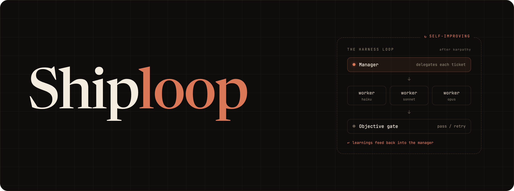

# shiploop

<p align="center">
  
</p>

<p align="center">
  <a href="https://github.com/anshss/shiploop/actions/workflows/ci.yml"></a>
  <a href="LICENSE"></a>
</p>

Lightweight orchestration layer that makes Claude Code faster and more token-efficient to your entire project. Adds capability, not bloat.

## Get Started

Install the plugin once, globally. `/shiploop:setup`, `/shiploop:flows` and the rest then appear in every session:

```
/plugin marketplace add anshss/shiploop
/plugin install shiploop@shiploop
```
or 
```
git clone https://github.com/anshss/shiploop.git ~/.claude/skills/shiploop &&
bash ~/.claude/skills/shiploop/install.sh
```

Then set it up on a project, once per project:

```bash
cd ~/code/your-project && claude   # then run: /shiploop:setup
```

Setup adapts to the folder’s state. An existing repo is wrapped in place: it moves into a subfolder but remains a separate Git repo, with history verified byte-for-byte and your cd path unchanged. A folder of repos, or an empty folder, gets a new scaffold. An existing workspace is upgraded component by component without changing your config.

You can add all repos related to you project into this folder.

Shiploop detects sub-repos, ports, dev commands, and your package manager, asks all questions in one batch, then completes setup. It never overwrites your README.md, CLAUDE.md, config, or governor files without --yes; before wrapping, it creates .wrap-undo.sh.

## Built to Spend Fewer Tokens

One goal: minimize tokens per shipped work. These are the levers that materially change that outcome.

- **Model orchestration.** Start with the lowest-cost capable model and escalate only after a clear failure. Failed attempts are usually far cheaper than successful ones, so a cheap first pass reduces average cost without compromising difficult work.

- **A Worker runs on a stripped down session.** Shiploop trims tool definitions to each worker’s actual needs, reducing request overhead that otherwise compounds across long-running sessions. No slash commands, no personal settings, no MCP servers, and only the tools the ticket actually needs. Trimming the tool list alone cuts tool bytes by 66.7% and the whole request by **−34.5%** ([full methodology](PROOF.md)).

- **Routine changes are handled by code, not a model.** Much of a backlog is mechanical: flip a default, add a key, bump a version, apply a known rename. Shiploop detects those during the survey it already runs, then applies and verifies them deterministically, with no model in the loop. Anything ambiguous, unverified, or unsafe falls back to the normal worker automatically.

- **Successful outputs are kept out of the transcript.** Everything in a session is re-sent on every turn that follows, and test output is most of what a worker generates. A green run carries no information, so it never enters; failures come through trimmed to the useful part. Failing CI logs arrive the same way: a short scripted excerpt, not a fresh investigation.

- **A watchdog cuts sessions that loop, stall, or just keep erroring.** A stuck worker would otherwise burn tokens all the way to its timeout; the watchdog kills it the moment its transcript shows the pattern. Hard token budgets work the same way, per worker and per run: past the ceiling the worker is killed and its worktree kept, so the work resumes instead of restarting. Both ship off and turn on with one knob each.

- **A scripted codebase map is shared by every worker.** Before dispatch, plain scripts index the repo: what files exist, where symbols live, how it all fits together. Every worker starts with that index instead of burning tokens reading files to learn the same layout. A retry inherits the previous attempt's findings the same way, and the manual audit reads only what's new since its last pass.

- **A retry resumes instead of restarting.** Exploration is most of what a ticket costs, and before this a failed attempt bought you literally nothing. Now the worktree is preserved, so attempt two doesn't re-clone or re-explore, and it inherits the previous attempt's work.

- **Memory improves without growing.** Every resolved ticket writes a lesson into CLAUDE.md, a file that is re-sent on every turn forever. So lessons are length-capped, the file has a budget, and overflow moves to an appendix.

- **Some tickets are blocked before work begins.** Check dependencies, repository health, capacity, setup, and if another fleet pushed the identical fix up, you get told to pull it down instead of a worker re-deriving it from scratch, so work that cannot succeed never consumes a worker and avoids waste of tokens.

- **Related tickets can duplicate the same exploration.** One worker can take several tickets whose scout-measured file paths actually overlap, so it explores that area once instead of once per ticket resulting in token savings. A 5-ticket batch is nowhere near 5× cheaper than 5 workers.

Tokens are the currency: shiploop breaks work into tickets, you choose which ones matter, and each dispatched ticket gets done at the least spend. A few practical notes: the coordination layer itself does not consume model tokens. The zero-model lane ships off until you enable it. Parallel work improves throughput, not per-ticket efficiency.

## How Shiploop Runs

You pick the tickets. Naming them is the only way work starts: there is no backlog sweep, because a
sweep spends on queue-order priorities and you have your own. Two layers are created for you: one
**workspace** and a fresh **worker** for every ticket.

**The workspace.** `/shiploop:setup` wraps your existing repo instead of absorbing it. Your code moves into a subfolder but remains its own git repo with its full history. The path you `cd` into stays the same. Everything alongside it is plain text you can read and edit:

```yaml
your-project/
  <your-repo>/              # your code, untouched, still its own git repo
  queue/tickets.md          # the queue you dispatch from, one `## #N` per ticket
  governor/                 # doctrine, escalations, improvements
  scripts/                  # bash: status / dev / doctor / worktrees / govern
  scripts/lib/workspace.sh  # the ONE config file; every knob lives here
  CLAUDE.md                 # git-tracked memory; every resolved ticket adds a lesson
```

**The scripts** form the bash harness. `run-loop.sh` deterministically owns state and control flow. It never calls a model. `spawn-worker.sh` builds each worker prompt and launches it. `config-check.sh` validates the full configuration with zero tokens and no Claude auth. Because orchestration is deterministic bash, deciding what to do costs no tokens. Only the work itself spends them.

**The worktree** makes parallelism safe. Each ticket gets its own git worktree, created from an up-to-date `main`. Every in-scope sub-repo gets a ticket-named branch. Out-of-scope sub-repos get a detached, read-only checkout so workers can inspect them without changing them. Workers cannot collide, runs do not inherit prior bad state, and context stays flat across tickets. On failure, the worktree remains so a retry can resume. It is removed only after the work lands, and never while it contains unpushed commits.

**The worker** is a fresh, headless `claude -p` session in that worktree. It receives a fixed prompt skeleton, your operator doctrine from `governor/preferences.md`, the ticket text, the scout’s verified file paths, and the previous handoff on retries. It is also intentionally restricted: no MCP servers, slash commands, personal user settings, or unnecessary tools. This is not only about cost. A single-purpose worker does not need scheduling, notification, or orchestration tools, and every unused schema is dead weight resent across roughly 218 turns. The worker completes the task, opens a PR, and writes a structured report that the bash driver uses to determine the next step.

Autonomy is bounded by the trust ladder below, not the scaffolding. Workers bypass permissions by design, but operate only in a disposable worktree and on the branch they push.

## How it works

The governor is a **pure-bash driver** (`scripts/govern/run-loop.sh <N> ...`): you name the tickets, it owns state and control flow deterministically, and it spends near-zero Claude context. Model tokens burn only inside the fresh headless workers it spawns. Naming several tickets partitions them into **locality groups** by measured file overlap first, so two concurrent workers are never put on the same file, and every gate (claim lock, `Depends on:`, staleness, base-CI, upstream-drift, failure-streak) runs on every dispatch.

<p align="center">
  <picture>
    <source media="(prefers-color-scheme: dark)" srcset="assets/how-it-works-dark.svg">
    
  </picture>
</p>

- **One ticket = one fresh headless session** in its own git worktree. Context stays flat, workers ship in parallel without collisions, no run inherits the last one's bad state.
- **Cheap floor, escalate once.** Every ticket dispatches at `GOVERN_WORKER_MODEL` (default `sonnet`); a classified failure escalates it exactly once to `GOVERN_WORKER_ESCALATION_MODEL` (default `opus`). No per-ticket prediction, because prediction was tried and measured as a rubber stamp. A cheap **scout pass** (haiku) still runs before dispatch, but it now only *surveys* (verified file paths, whether tests cover the area, whether history holds a precedent commit) which the worker gets as a warm start, the batching layer keys on, and the zero-model lane uses as its patch source. Its result is cached per run, so a retry never re-scouts.
- **A manual audit** (`npm run govern:audit`, another cheap fresh session) reviews a run's state on demand and can return a `halt` verdict. Hard-stops land in `governor/escalations.md` for you. Zero model spend unless you invoke it.
- **It gets better over time.** Every resolved ticket promotes its durable lesson into the right `CLAUDE.md` before the entry is deleted: memory you can read, diff, and edit. Harness improvements accrete in `governor/improvements.md` (observe → propose → triage; never auto-applied to safety rails), and the hub channel (`/shiploop:update` / `/shiploop:push`) moves mechanism fixes between your workspace and the template repo. Always via human-reviewed PR.

## Trust

Autonomy is a ladder, not a switch. One knob, `GOVERN_AUTONOMY` in `scripts/lib/workspace.sh`, controls it:

| Rung | Behavior |
|---|---|
| `observe` | Workers do real work but every PR opens as a **draft**; nothing merges |
| `pr-only` | *(default on new scaffolds)* Normal PRs; a human clicks merge |
| `auto` | Auto-merge on green-or-no-checks CI, but only for repos on `GOVERN_MERGE_REPOS` (empty by default) |

What makes the top rung safe to reach for:

- **Three-factor merge guard.** A PR auto-merges only if its author is the governor's own worker identity, its branch matches the governor's naming, and its head is not from a fork. Any factor missing → stays open for a human.
- **Hard-stops.** Destructive git, prod data, destructive schema, secrets: the doctrine in `governor/preferences.md` makes a worker park + escalate instead of acting.
- **Bounded blast radius.** Workers run `claude -p --permission-mode bypassPermissions` by design, scoped to a throwaway worktree plus the branch it pushes; `.githooks/pre-push` rejects any harness-repo push except a sanctioned governor run.
- **Fail-closed evidence gates** on the self-improvement and sync ports: `bash -n`, a forbidden-identity-strings gate, and a scaffold-test baseline diff. Any failure escalates instead of merging.

Cost, observed: **$3.03 median / $4.49 mean per resolved ticket** ($1.34-$12.00 range, N=32 tracked tickets), from Claude Code's own reported cost, not an estimate. See **[PROOF.md](PROOF.md#4-cost-per-resolved-ticket)** for the full distribution and methodology. That sample predates the current cheap-floor default and skews `opus`-heavy on self-referential harness tickets, so treat it as an upper bound rather than an average; a `sonnet` floor observed ~$2.22/ticket. `config-check.sh` is the only truly free smoke ($0, no auth); `scripts/govern/run-loop.sh --dry-run` (say "dry-run the queue") runs a real worker in plan mode. Zero side effects, but it costs tokens. For your first run: keep the allowlist empty, watch one ticket end-to-end, and set a spend cap in your Anthropic dashboard.

## Commands

| Command | What it does |
|---|---|
| `/shiploop:setup` | Scaffold or upgrade a workspace: wrap-in-place inside an existing repo, or from a parent folder of repos |
| *(say "work on \<tickets\>")* | Ship the tickets you name: natural language onto the bash-driven ticket loop (`scripts/govern/run-loop.sh <N> ...`), end to end |
| `/shiploop:flows` | Inventory (`extract`), inspect (`list`), and validate (`file`) your product's user-facing paths |
| `/shiploop:update` | Pull the latest hub templates into this workspace (`workspace.sh` is never overwritten) |
| `/shiploop:push` | Port local mechanism improvements back to the hub as a human-reviewed PR (never auto-merges) |
| `npm run govern:audit` | Manual audit: review a run's state on demand, zero model spend unless invoked |
| `npm run govern:budgets` | Enforce context budgets (lesson char cap, learnings TTL) and run the evidence-based CLAUDE.md trim, all outside a dispatch; `--dry` to preview |
| `npm run govern:trim` | Evidence-based CLAUDE.md trim on its own: auto-move provably dead or duplicate blocks to the appendix, propose the rest (`--apply <hash>`, `--still-true <hash>`, `--dry-run`) |
| `npm run govern:externalize` | File open low-severity tickets as public good-first-issues and drop them from the queue (opt-in, off until `GOVERN_EXTERNALIZE_REPO` is set) |

`bash scripts/doctor.sh` warns when your workspace lags the hub by N releases, and **fails** when root `CLAUDE.md` exceeds its context budget (`SHIPLOOP_CLAUDEMD_MAX_CHARS`, default 14000), since an over-budget file is a tax on every turn of every session. `npm run govern:budgets` then trims on evidence, never on size: blocks whose every cited path or knob is provably gone (and exact duplicates) auto-move to `CLAUDE-APPENDIX.md`, everything else becomes a ranked proposal in `governor/claudemd-trim-proposals.md` for you to `--apply` or stamp `--still-true`. Doctor also reports how many proposals are pending.

## Configuration

Everything lives in one file: `scripts/lib/workspace.sh`. Advanced lanes ship **off** so a fresh install is inert until you opt in:

| Knob | Default | Turns on |
|---|---|---|
| `GOVERN_AUTONOMY` | `pr-only` | Trust-ladder rung (`observe` / `pr-only` / `auto`); absent = `auto` for pre-knob installs |
| `GOVERN_MERGE_REPOS` | empty | Per-repo auto-merge allowlist (requires `auto`) |
| `GOVERN_WORKER_MODEL` | `sonnet` | First-attempt **floor**: the tier every ticket dispatches at. A ticket's own `Model:`/`Effort:` fields no longer participate in dispatch |
| `GOVERN_WORKER_ESCALATION_MODEL` | `opus` | Escalate-once **ceiling**: the tier a classified judgment failure retries at. A ticket never escalates twice |
| `GOVERN_DETERMINISTIC` | `0` (off) | Zero-model lane: let the scout's mechanical patch resolve a ticket with **no model turns** on the fix. Over-strict guards; every doubt falls through to a normal worker |
| `GOVERN_SCOUT` | on | Pre-dispatch survey (verified file paths, coverage, precedent commit) used as a worker warm start, the batching key, and the zero-model patch source. It does **not** pick the tier |
| `GOVERN_SCOUT_MODEL` | `haiku` | Tier the scout pass itself runs at; recon should cost a rounding error |
| `GOVERN_SCOUT_TIMEOUT` | `180` | Seconds the scout pass may run before it is abandoned; dispatch proceeds without a survey |
| `GOVERN_PARALLEL_DEFAULT` | `4` | Locality groups a named `run-loop.sh <N> ...` dispatch works at once: `N > 1` runs N concurrent full-driver children, one per group (N× the spend); per-run `--parallel[=N]` / `--serial` override it. Naming exactly one ticket, or resolving to a single group, always collapses to sequential |
| `GOVERN_RETRY_NOTES_MAX_BYTES` | `16000` | Byte cap on the findings scratchpad (`.governor-notes.md`) a retry inherits from the previous attempt; the full file stays on disk in the preserved worktree |
| `GOVERN_LESSON_MAX_CHARS` | `600` | Char cap on a single lesson promoted into `CLAUDE.md`; overflow keeps the lead rule inline and parks the full text in `CLAUDE-APPENDIX.md` |
| `SHIPLOOP_CLAUDEMD_MAX_CHARS` | `14000` | Total budget for root `CLAUDE.md` (alias `GOVERN_LESSON_BUDGET_CHARS`); enforced by `npm run govern:budgets` and checked by `doctor`. Past the ceiling the evidence-based trim proposes candidates, it never blind-evicts |
| `GOVERN_TRIM_DEAD` | `1` (on) | Lane 1 of the CLAUDE.md trim: auto-move blocks whose every cited path/knob is provably absent from the workspace, plus exact duplicates, into `CLAUDE-APPENDIX.md`. `0` disables auto-moves, leaving proposals only |
| `SHIPLOOP_LEARNINGS_TTL` | `0` (off) | Age out `learnings.md` entries older than `SHIPLOOP_LEARNINGS_TTL_DAYS` (default `14`) when `npm run govern:budgets` runs |
| `GOVERN_WORKER_TOOLS` | `default` (on) | Tool-schema trim: passes `--tools <recommended list>` to every worker, cutting the measured 51.7% of the request that tool JSON occupies down to 26.3% (−34.5% request bytes; see `PROOF.md` §5). Or give your own space/comma-separated list. Capability-probed, so an older CLI just skips it |
| `WSP_LINT_FIX_CMD` | empty | Pre-commit lint/format fix across sub-repos |
| `GOVERN_LOCAL_FIRST_REPOS` | empty | Repos with no prod DB: additive migrations merge instead of parking |
| `GOVERN_PUBLIC_REPOS` | auto-detect | Public repos get neutral `sl-<hex>` branches, no ticket ids on PRs |
| `GOVERN_PR_TICKET_REF` | `0` (ids suppressed) | `1` puts the internal ticket id back in PR titles/bodies/commit subjects. By default every worker is told to keep `#N` off the PR and the run-loop scrubs title+body as a backstop; branches stay `ticket-<N>` either way. The opt-out never applies to a **public** repo |
| `GOVERN_EXTERNALIZE_REPO` / `_SUBREPO` | empty | Stage low-severity OSS tickets as public "good first issue"s, filed only on your approval |
| `GOVERN_UPSTREAM_HARNESS_REPO` / `_DIR` | empty | The `/shiploop:push` sync channel to your hub fork |
| `WSP_PR_FOOTER` | on | "shipped by shiploop" attribution line on worker PRs (`off` to suppress) |
| `GOVERN_EVENTS` | `0` (off) | Fleet event log: append one JSON line per worker spawn/finish/escalation/park to `governor/events.jsonl`. Nothing reads it until you turn it on, and nothing about a run changes when you do. This is what `npm run govern:status`, the statusline segment, and the plugin monitor all fold; see **Fleet visibility** below |
| `GOVERN_EVENTS_FILE` | `governor/events.jsonl` | Where that log lives |

### Fleet visibility

Governor workers are detached `claude -p` processes. Their pid lives only in a bash array inside
`run-loop.sh` and structured state is written only at completion, so while a run is in flight
*nothing on disk says "running"*, which is why no surface could ever show them.

`GOVERN_EVENTS=1` fixes that with one append-only log, `governor/events.jsonl`, and three readers
fold it. The emitter can never abort a run: a failed append is swallowed silently, by construction.

```
$ npm run govern:status
fleet: 2 active · 3 resolved · 1 parked · 0 failed · 1 escalated
run:   gov-20260901T101500Z-4242 (running, mode=live, up 41m)
  #94    opus     22m    pid 44112  effort=high
  #97    sonnet   4m     pid 44530  effort=medium
drivers: 2 live: #94(pid 44098) #97(pid 44520)
```

| Surface | What it is | How to get it |
|---|---|---|
| `npm run govern:status` | One-shot reader. Text, or `--json` for machines. Verifies every claimed-live worker with `kill -0` and reaps the phantoms a killed driver leaves behind. No model call, no lock, so it is safe from inside a session, from CI, or over SSH | Ships with the harness |
| Statusline segment | `⚙ 4/6 · #94 opus 22m` in your Claude Code statusline. Silent when no fleet is running | `/shiploop:statusline`; explicit, opt-in, and it **chains**: your existing `statusLine.command` is recorded verbatim and wrapped, never replaced. `uninstall` restores it byte for byte |
| Plugin monitor | The in-session channel. Prints one line per state *transition* (never a raw tail), which Claude Code turns into a notification in your session | Automatic with the plugin; silent in any session with no event log. `GOVERN_MONITOR=0` to disable |

The monitor is deliberately stingy: every line it prints costs context in the very session shiploop
exists to keep cheap. It dedupes repeated states, caps itself at 6 lines/minute
(`GOVERN_MONITOR_MAX_PER_MIN`), attaches at the *end* of the log so history is never replayed, and
prints nothing at all when there is no fleet.

### Permissions

| Knob | Default | Turns on |
|---|---|---|
| `GOVERN_PERMISSION_MODE` | `bypassPermissions` | The `--permission-mode` every headless worker runs under. The default lets a worker act without prompting, which is what makes an unattended run possible, and also the single widest grant in the harness. Tighten it if you want workers to stop at the permission boundary; note that a mode which prompts will stall a headless run rather than fail it |
| `GOVERN_WORKER_MCP` | `0` (off) | Give workers the workspace's MCP servers. Off by default: MCP tool schemas are re-sent on every turn, so this is a standing per-turn cost |

### Hard bounds: how a run is guaranteed to end

| Knob | Default | Turns on |
|---|---|---|
| `GOVERN_MAX_TICKETS` | `20` | Tickets one driver will work before stopping. **Per driver**, so a `--parallel` dispatch's real ceiling is N × this |
| `GOVERN_MAX_BAD_STREAK` | `4` | Consecutive parked/failed tickets before the run halts itself |
| `GOVERN_MAX_RUNTIME` | `0` (no cap) | Wall-clock seconds. There is **no** time bound unless you set one |
| `GOVERN_WORKER_TIMEOUT` | `3600` (1h) | Seconds one worker may run before it is killed rather than left stalled |
| `GOVERN_WORKER_MAX_TOKENS` | `0` (unlimited) | Token ceiling per worker; crossing it kills the worker with a distinct `budget-exceeded` outcome |
| `GOVERN_MIN_FREE_GB` | `5` | Free-disk floor checked before spawning; below it the run stops rather than filling the volume |

### CI, retries, and cadence

| Knob | Default | Turns on |
|---|---|---|
| `GOVERN_CI_INTERVAL` | `30` | Seconds between CI polls while awaiting checks |
| `GOVERN_CI_MAX_TRIES` | `60` | Polls before CI is treated as never-settling (≈30 min at the default interval) |
| `GOVERN_CI_FIX_TRIES` | `1` | Attempts a worker gets at fixing its own red CI before the ticket parks |
| `GOVERN_CONFLICT_FIX_TRIES` | `1` | Attempts at resolving a merge conflict before parking |
| `GOVERN_INFRA_RETRY` | `1` | Retries for an infrastructure-class failure (API/transport). Retried at the **same** model tier, not escalated |
| `GOVERN_INTERRUPT_RETRY` | `1` | Retries for a worker killed mid-flight |
| `GOVERN_SUPERVISOR_MODEL` | `sonnet` | Tier the manual audit (`govern:audit`) runs at |
| `GOVERN_BATCH_MAX` | `2` | Tickets with overlapping scout-measured file paths that one worker may take as a group, exploring once and opening one PR. Kept low because no production A/B measurement of batching exists yet; `1` disables it |

### Binaries

| Knob | Default | Turns on |
|---|---|---|
| `GOVERN_CLAUDE_BIN` | `claude` | Path to the Claude Code CLI; set it for a non-standard install or to pin a version |
| `GOVERN_GH_BIN` | `gh` | Path to the GitHub CLI |

Knobs not listed here (`GOVERN_TICKETS_FILE`, `GOVERN_QUEUE_DIR`, `GOVERN_LOG_ROOT`, `GOVERN_LOCK*`, `GOVERN_TEMPLATE_DIR`, and similar path overrides) exist for test and scaffold plumbing. They are overridable but are not tuning surface, so treat them as internal.

## Requirements

- **Claude Code CLI**: Act 1 (setup + extract) needs only this, git, and `jq`
- **`jq`**: hard-required; the scaffolder and governor fail closed without it
- **`gh` CLI**, authenticated, for the governor (opens PRs, reads CI); not needed for the risk map
- **git ≥ 2.20**, **bash ≥ 4** (macOS's 3.2 also works, templates are guarded for both)

## How it compares

Devin, Cursor, Copilot, and Claude Code all do one task you hand them well. shiploop is the layer above: it runs a **backlog** across a **fleet** (a manager, not another IC). If your bottleneck is one hard task, use those. If it's a growing queue of small-to-medium changes across N repos, and you'd rather do the spec work than the shipping, use this.

## Proof

281 tickets resolved end-to-end on the maintainer's production multi-repo product, of 290 governor-authored PRs merged (0 confirmed reverts); measured June-Aug 2026 under the autonomous sweep that v1.18.0 removed, through the same spawn-worker dispatch path that remains. The harness audits, fixes, and releases *itself* through the same loop. Every governor edge case found in the field ports back into these templates with a regression test, and the hermetic suite goes RED in CI before a breaking change can merge. See **[PROOF.md](PROOF.md)** for the full sanitized evidence artifact: auto-merge/human-merge split, revert rate, cost-per-ticket distribution, and the exact re-runnable queries behind every number.

## Contributing

See [CONTRIBUTING.md](CONTRIBUTING.md). Everything the scaffolder installs lives under `templates/`; the slash commands under `commands/`; hermetic governor tests under `templates/govern/test/` (hub-only; the suite is not installed into a workspace).

## License

[Apache License 2.0](LICENSE). Includes an express patent grant and a
trademark reservation; redistributions must carry the [NOTICE](NOTICE) file
and state any changes made. Releases up to and including v1.15.1 were
published under the MIT license and remain available under those terms.
