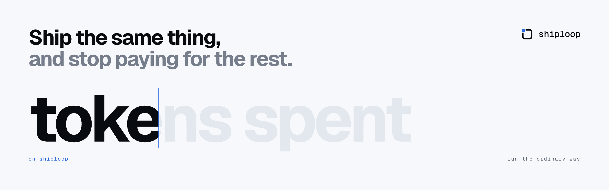

<p align="center">
  
</p>

<p align="center">
Shiploop is a harness for Claude Code that makes you build faster.  <br> 
Shiploop gives each task the right model, context, and execution path so Claude can ship more work with less wasted effort.
</p>

## Get Started

Install the plugin globally once. `/shiploop:setup` and the rest then appear in every session:

```
/plugin marketplace add anshss/shiploop
/plugin install shiploop@shiploop
```
or 
```
git clone https://github.com/anshss/shiploop.git ~/.claude/skills/shiploop &&
bash ~/.claude/skills/shiploop/install.sh
```

Then set it up on a project, once per project:

```bash
cd ~/code/your-project && claude   # then run: /shiploop:setup
```

Setup adapts to the folder. A single existing repo is wrapped in place: moved into a subfolder while remaining a separate Git repo, with history verified byte-for-byte and your cd path unchanged. A folder of repos or an empty folder gets a new scaffold; existing workspaces are upgraded component by component without changing your config.

Add every repo related to your project to the folder. Shiploop detects sub-repos, ports, dev commands, and your package manager, asks all setup questions in one batch, then finishes setup. It never overwrites README.md, CLAUDE.md, config, or governor files without --yes, and creates .wrap-undo.sh before wrapping.

## How Shiploop works

You launch regular Claude Code sessions to build your project. What comes out of those conversations gets broken into short items called **tickets**, kept in one file, the **queue**. You choose which tickets run and in what order: dispatch is a call you make by naming tickets, not an automatic sweep through the whole queue.

How a named ticket actually ships, in one pass:

1. Each ticket gets a fresh worker in its own Git worktree. It reads only what it needs, makes the change, opens a pull request, and reports the result. Parallel tickets never collide or inherit each other’s state.
2. Advisor-worker orchestration. An interactive Claude session acts as the advisor and delegates work to subagents using the right model for each task. If a subagent hits a judgment failure, it increases reasoning effort and sends the issue back to the advisor for re-specification.
3. Memory improves over time. Resolved tickets leave short lessons in CLAUDE.md, which later sessions read so each new worker starts with what the system has already learned.

### Core Idea

- **Multi-repo workspace.** Multiple repos can be driven as one workspace from a single terminal.

- **Advisor + workers.** One advisor session thinks and plans. Workers do the coding, each in its own git worktree, so parallel work does not collide.

- **Persistent context.** Manages context across sessions, preserving learnings from failures and allowing retries to resume instead of starting over.

- **Model orchestration.** Matches work to the right model tier, with higher-tier sessions planning solutions and lower-cost workers handling implementation.

- **Deterministic work.** Identifies work that can be handled deterministically and skips the model when it can.

- **Task queue.** Every task is written to a queue file first, so work is not lost if a session dies.

- **Shared codebase knowledge.** Workers share codebase knowledge, avoid repeated exploration, stay lean, and filter noise from successful runs.

- **Parallel exploration.** Related tasks can share exploration instead of repeatedly rediscovering the same part of the codebase.

- **Runaway protection.** Watchdogs detect stalled or runaway sessions while preserving the worktree so work can resume.

## Dispatch flow

You name the tickets, and the coordination happens almost entirely outside Claude. A small check runs before anything starts, and another step waits for CI, merges, and completes the ticket. Claude only uses tokens for the actual work in between. Every dispatch checks the same gates: claim lock, dependencies, staleness, base CI, upstream changes, and recent failures.

<p align="center">
  <picture>
    <source media="(prefers-color-scheme: dark)" srcset="assets/how-it-works-dark.svg">
    
  </picture>
</p>

- **Inside the worktree.** Branches are ticket-named in every in-scope sub-repo; out-of-scope sub-repos stay detached and read-only. A worker's prompt is built from a fixed skeleton, `governor/preferences.md`, the ticket text, and, on a retry, the prior attempt's handoff. It can act without asking permission at each step, but only inside that worktree, on the branch it pushes.
  
- **Manual audit on demand** `npm run govern:audit` starts another small, fresh session to review a run and can return halt. Hard stops go to `governor/escalations.md`. It spends no model tokens unless you invoke it.

- **Harness improvement follows discipline.** Fixes to the mechanism itself go to `governor/improvements.md` through observe, propose, triage, and never auto-apply to safety rails. `/shiploop:update` and `/shiploop:push` move those fixes between the workspace and template repo, always through a human-reviewed PR.

## Glossary

One noun, one meaning. Every page pairs a term with its definition on its first prose use, because none of these
words is exclusively ours: Factory's docs, for one, call their in-session delegated children "worker
agents". In shiploop they mean exactly this:

| Term | Definition |
|---|---|
| **driver** | Your interactive Claude Code session, acting as the advisor. It decides what a change is, writes that down as the ticket's `**Proposed solution:**`, dispatches a worker to implement it, and steers that worker mid-run. It delegates reading and execution to children rather than bulk-reading product source itself. |
| **worker** | The one subagent type that takes a ticket: `Agent(subagent_type: "worker")`, working in a worktree it creates itself, ending at an open PR plus a JSON report (`resolved`, `parked` or `failed`). Only this type is ever called a worker, and ticket-shaped work goes only to it. |
| **subagent** | The platform's term for any Agent-tool child, the worker included. The other shipped types are `lookup` (haiku, single-fact lookups) and `investigator` (sonnet, multi-file diagnosis). |
| **governor** | The script layer under `scripts/govern/`. `pre-dispatch-check.sh` gates a ticket (`proceed`, `skip:` or `refuse:`); `resolve-ticket.sh` waits for CI, merges, and records the resolution in the ticket file. That path never calls a model. Deciding *when* to run it is the driver's job. |

## Commands

| Command | What it does |
|---|---|
| `/shiploop:setup` | Scaffold or upgrade a workspace: wrap-in-place inside an existing repo, or from a parent folder of repos |
| *(say "work on \<tickets\>")* | Ship the tickets you name: natural language onto the session lane (`pre-dispatch-check.sh` → a worker → `resolve-ticket.sh`), end to end, one ticket at a time |
| `/shiploop:flows` | Inventory (`extract`), inspect (`list`), and validate (`file`) your product's user-facing paths |
| `/shiploop:compress` | Compress this workspace's `CLAUDE.md` by moving mechanically-triggered rules into just-in-time rule packs, deleting none of them (operator-triggered, never automatic) |
| `/shiploop:update` | Pull the latest hub templates into this workspace (`workspace.sh` is never overwritten) |
| `/shiploop:push` | Port local mechanism improvements back to the hub as a human-reviewed PR (never auto-merges) |
| `npm run govern:externalize` | File open low-severity tickets as public good-first-issues and drop them from the queue (opt-in, off until `GOVERN_EXTERNALIZE_REPO` is set) |

`bash scripts/doctor.sh` warns when your workspace lags the hub by N releases, and **fails** when root `CLAUDE.md` exceeds its context budget (`SHIPLOOP_CLAUDEMD_MAX_CHARS`, default 14000), since an over-budget file is a tax on every turn of every session.

### Fleet visibility

A worker is a subagent the session runs to completion, and structured state is written only when
it finishes, so while one or more are in flight at once *nothing on disk says "running"* on its
own, which is why no surface could ever show them without instrumentation.

`GOVERN_EVENTS=1` fixes that with one append-only log, `governor/events.jsonl`, and three readers
fold it. The emitter can never abort a dispatch: a failed append is swallowed silently, by construction.

```
$ npm run govern:status
fleet: 2 active · 3 resolved · 1 parked · 0 failed · 1 escalated
run:   gov-20260901T101500Z-4242 (running, mode=live, up 41m)
  #94    opus     22m    pid 44112  effort=high
  #97    sonnet   4m     pid 44530  effort=medium
```

## Configuration

Every knob lives in one file, `scripts/lib/workspace.sh`, and ships with sane defaults so a fresh
install is inert until you opt in. Full table and behaviour: [CONFIGURATION.md](CONFIGURATION.md).

## Contributing

See [CONTRIBUTING.md](CONTRIBUTING.md). Everything the scaffolder installs lives under `templates/`; the slash commands under `commands/`; hermetic governor tests under `templates/govern/test/` (hub-only; the suite is not installed into a workspace).

## License

[Apache License 2.0](LICENSE). Includes an express patent grant and a
trademark reservation; redistributions must carry the [NOTICE](NOTICE) file
and state any changes made. Releases up to and including v1.15.1 were
published under the MIT license and remain available under those terms.
